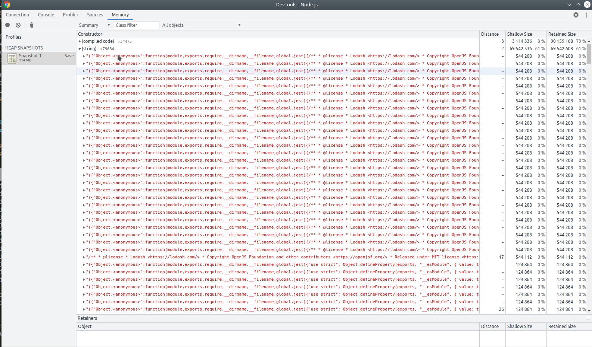

## Jest memory leak reproduction

When running jest >= 25 - 27.4.4 with the --runInBand option,
it seems to leak memory when importing modules even when the tested files are trivial.

### How to run

Install all dependencies by running
```shell
npm run build
```

Run the test set in tests/ with version 24.9.0
```shell
npm run test24
```

Run the test set in tests/ with version 25.1.0
```shell
npm run test25
```

### Results
When attaching a debugger, after the test run and garbage collection, the memory in use by v24 is considerably lower than the memory in use by 25.
Memory snapshots can be found in /results, as you can see below, there are multiple strings in memory which seem to be the lodash module.


